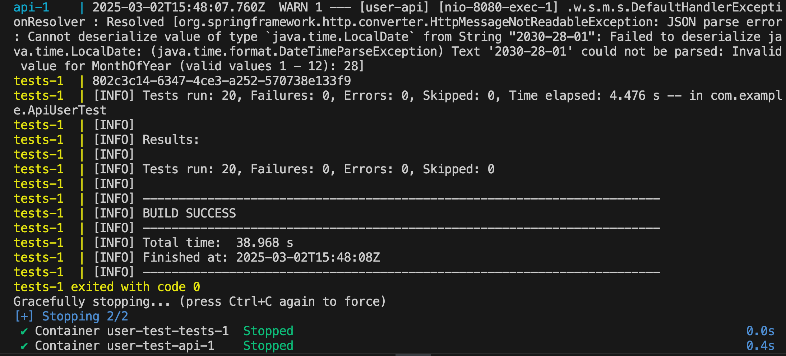
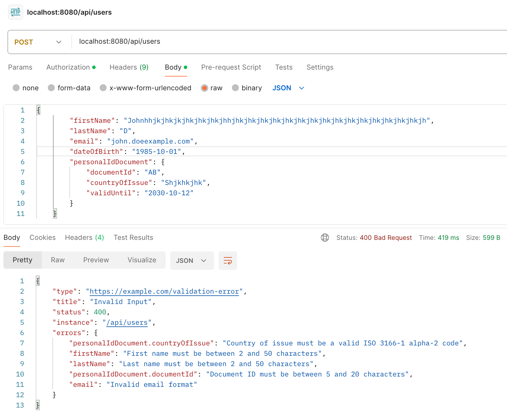

The testing framework contains its own REST API implementation.

To run the tests against my REST API (in the 'api' Docker container):
```
docker-compose up --build
```

To run the tests against your REST API (at localhost:8080/api):
```
API_BASE_URL=http://host.docker.internal:8080/api docker-compose up --build
```

Test run results:


Different types of error messages could also be validated, but this has not been implemented in the current version of automated tests (only status codes are tested for all these cases at the moment):

