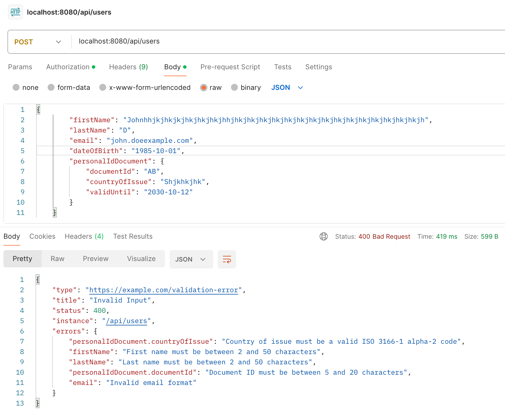

# user-api-test

## To run the tests:

- All tests:
```
mvn test
```
- One test file:
```
mvn test -Dtest=ApiUserTest
```
- One test method:
```
mvn test -Dtest=ApiUserTest#postRequestWithValidInput test
```
## Error messages can also be validated, but this has not been implemented in auto-tests:

